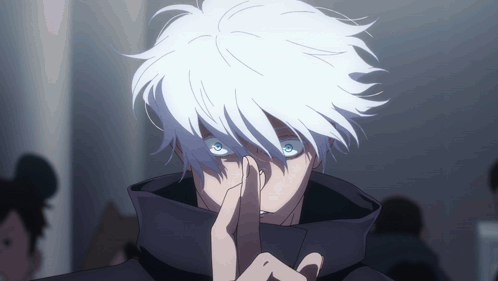

# 🖐️ Tarea 1 UT7 — Gestos + RA + Modelo GLTF

Proyecto de la asignatura **Aplicaciones Naturales de Usuario** (2º DAM) de **Ancor Valentín Martín**.

App React + Vite que combina **detección de gestos por webcam**, **realidad aumentada** y **modelos 3D en formato GLTF**. Y un par de **easter eggs de Jujutsu Kaisen** porque sí 😏

---

## ✨ Características

- 👉 **Gesto `point`** → alterna el color de fondo entre rosa y morado neón.
- 🍩 **Página AR** con un toroide verde menta brillante (en vez del cubo aburrido).
- 🦆 **Página `ARAncor`** que carga un modelo 3D `.glb` (un patito clásico de Khronos) usando `@react-three/fiber` y `drei`.
- 🥷 **Easter eggs JJK detectados por la cámara**:
  - ✌️ Pinch → `Expansión de dominio: Vacío Inconmensurable` (Gojo)
  - ✋ Mano abierta → `Santuario Malévolo` (Sukuna)

---

## 📸 Capturas

> _(Reemplaza estas líneas por capturas reales cuando las tengas)_

| Home cyberpunk | Página AR (toroide) | ARAncor con el patito |
|---|---|---|
|  |  |  |

| Easter Egg Gojo ✌️ | Easter Egg Sukuna ✋ |
|---|---|
|  |  |

---

## 🚀 Cómo lanzarlo

```bash
npm install
npm run dev
```

Abre `http://localhost:5173`. Tienes que dar permisos de cámara para los gestos. Para la AR necesitas un dispositivo compatible con WebXR (móvil Android moderno con Chrome).

---

## 🛠️ Stack

- React 18 + Vite 6
- Material UI 6
- `@react-three/fiber`, `@react-three/drei`, `@react-three/xr`
- `handtrackjs` para detección de gestos
- `react-speech-recognition` (compartida con la Tarea 2)

---

## 🎨 Paleta

Cyberpunk: morados profundos `#9D4EDD`, verde menta neón `#5EEAD4` y rosa fucsia `#ff006e`.
Adiós al azul soso de MUI por defecto.
